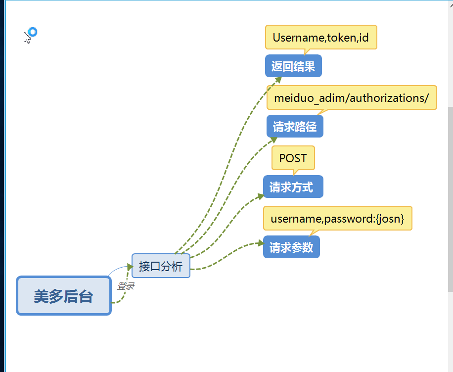

# -0.2
美多商城后台

#### 1、项目环境的配置

​	

### 1、业务说明

​	验证用户名和密码成功后，为用户签发JWT,前端将签发JWT保存下来。

### 2、后端接口设计 

​	**请求方式**：POST  meiduo_admin/authorizations/

​	**请求参数**：JSON 或者 表单

|  参数名  | 类型 | 是否必须 |  说明  |
| :------: | :--: | :------: | :----: |
| useranme | str  |    是    | 用户名 |
| password | str  |    是    |  密码  |

**返回**：JSON

​	{

​		"useranme":"##",

​		"user_id": ##,

​		"token":"##"

​	}

|  返回值  | 类型 | 是否必须 |    说明    |
| :------: | :--: | :------: | :--------: |
| useranme | str  |    是    |   用户名   |
|    id    | int  |    是    |   用户id   |
|  token   | str  |    是    | 身份证凭证 |

