# -0.2

美多商城后台


#### 1、项目环境的配置

​	


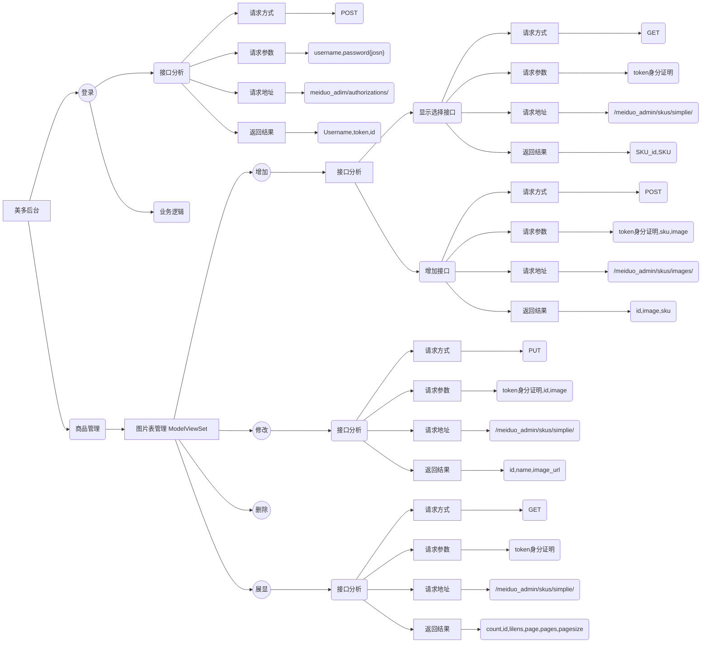


### 1、业务说明

​	验证用户名和密码成功后，为用户签发JWT,前端将签发JWT保存下来。

### 2、后端接口设计 

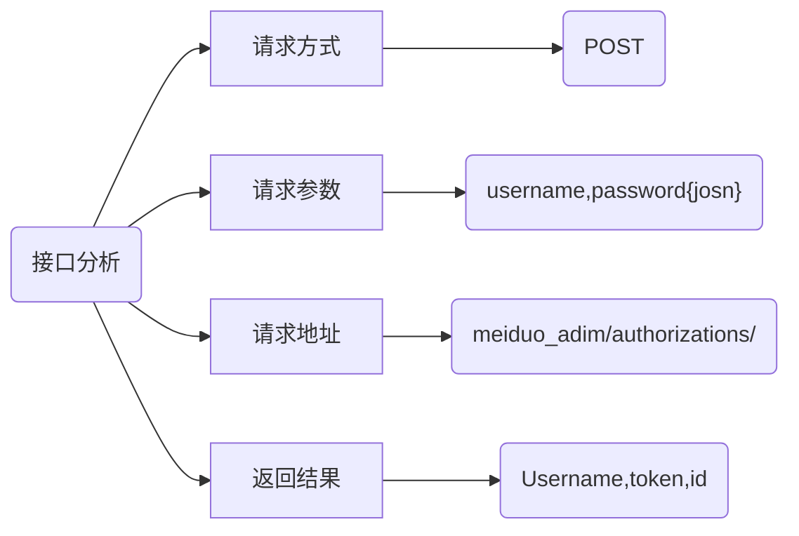


​	**请求方式**：POST  meiduo_admin/authorizations/

​	**请求参数**：JSON 或者 表单

|  参数名  | 类型 | 是否必须 |  说明  |
| :------: | :--: | :------: | :----: |
| useranme | str  |    是    | 用户名 |
| password | str  |    是    |  密码  |

**返回**：JSON

​	{

​		"useranme":"##",

​		"user_id": ##,

​		"token":"##"

​	}

|  返回值  | 类型 | 是否必须 |    说明    |
| :------: | :--: | :------: | :--------: |
| useranme | str  |    是    |   用户名   |
|    id    | int  |    是    |   用户id   |
|  token   | str  |    是    | 身份证凭证 |


### 1、业务说明

​	通过rest_frame中的GenteAPIView视图类完成

```

```

统计功能 

### 2、后端接口设计


​	**请求方式**：GET

​	**请求参数**：JSON

| 参数名 | 是否必传 | 类型 |   说明   |
| :----: | :------: | :--: | :------: |
| token  |    是    | str  | 身份凭证 |


​	**返回参数**

{

"user_count": count,

"datetime":time

}

|  返回参数  |   类型   | 是否必传 |   说明    |
| :--------: | :------: | :------: | :-------: |
| user_count |   int    |    是    | 统计个数  |
|  datatime  | datatime |    是    | 统计 时间 |


## 日增用户接口定义

### 1、接口分析

​	**请求方式**：GET /meiduo_admin/statistical/day_increment/

​	**请求参数**： 请求传递token(身份验证参数)

​	**返回参数**：JSON

{

'date'：new_user_date,

"count": day_create_count

}

|  返回参数  |   类型   | 是否必传 |       说明       |
| :--------: | :------: | :------: | :--------------: |
|    date    | datetime |    是    |     今日时间     |
| user_count |   int    |    是    | 今日用户创建个数 |

## 日活用户接口定义

### 1、后端接口设计

​		**请求方式**：GET /meiduo_admin/statistical/day_activate

​		**请求参数**：JWT token（头部传递）

| 请求参数 | 类型 | 是否必传 | 携带部位 |   说明   |
| :------: | :--: | :------: | :------: | :------: |
|  token   | str  |    是    | 请求头部 | 身体验证 |

**返回参数：**

{

"conut"：day_activate_count,

"date": date_day

}

| 返回参数 | 类型 | 是否必需 |      说明      |
| :------: | :--: | :------: | :------------: |
|  count   | int  |    是    | 日活用户总个数 |
|   date   | date |    是    |    当天日期    |

## 下单用户接口


### 1、接口分析

​	**请求方式**：GET

​	**请求参数**：JWT token


| 请求参数 | 类型 | 是否必传 | 携带部位 |   说明   |
| :------: | :--: | :------: | :------: | :------: |
|  token   | str  |    是    | 请求头部 | 身体验证 |

**返回参数：**

{

"conut"：day_activate_count,

"date": date_day

}

| 返回参数 | 类型 | 是否必需 |      说明      |
| :------: | :--: | :------: | :------------: |
|  count   | int  |    是    | 下单用户的个数 |
|   date   | date |    是    |  当天日期下单  |

------


## 月增用户接口


### 1、接口设计

​	**请求方式**：get /meiduo_admin/statistical/month_increment/

​	**请求参数**：JWT token

| 请求参数 | 类型 | 是否必传 | 携带部位 |   说明   |
| :------: | :--: | :------: | :------: | :------: |
|  token   | str  |    是    | 请求头部 | 身体验证 |

​	**返回结果**：JSON

[

{"count": day_createuser，“date”：day_date},

{"count": day_createuser，“date”：day_date},

......（共三十天）

]

| 返回值 | 类型 | 是否必传 |    说明    |
| :----: | :--: | :------: | :--------: |
| count  | int  |    是    | 日增用户数 |
|  date  | date |    是    |  当天时间  |

## 日分类访问类


### 接口分析

​	**请求方式**：GET /meiduo_admin/statistical/goods_day_views/

​	**请求参数**：token

| 请求参数 | 类型 | 是否必传 | 携带部位 |   说明   |
| :------: | :--: | :------: | :------: | :------: |
|  token   | str  |    是    | 请求头部 | 身体验证 |

​	 **返回参数**：JSON

```json
 [
        {
            "category": "分类名称",
            "count": "访问量"
        },
        {
            "category": "分类名称",
            "count": "访问量"
        },
        ...
    ]
```

| 返回参数 | 类型 | 是否必需 |   说明   |
| :------: | :--: | :------: | :------: |
| category | str  |    是    |  分类名  |
|  count   | int  |    是    | 日访问量 |

## 用户管理

### 

### 用户查询分析

​	**请求方式**：GET /meiduo_admin/users/?keyword=<搜索内容>&page=<页码>&pagesize=<页容量>

​	**请求参数**：JWF token，Keywork，page，pagesize

|   参数   | 类型 | 是否必传 | 携带部位 |    说明    |
| :------: | :--: | :------: | :------: | :--------: |
|  token   | srt  |    是    |  请求头  |  身份验证  |
| Keywork  | srt  |    否    |  请求行  |   关键词   |
|   page   | int  |    否    |  请求行  |   第几页   |
| pagesize | int  |    否    |  请求和  | 每页最大数 |

​	**返回参数**：JOSN

```JSON
{
    "count": username.count().
    "lines":[
        {
        "id":user.id,
        "username":user.name,
        "phone":user.phone,
        "email":user.email,
        },
        {
        "id":user.id,
        "username":user.name,
        "phone":user.phone,
        "email":user.email,
        }
        .....
    ],
	"page":page,
	"pages":page.count(),
	"pagesize":pagesize,
}
```

| 返回参数 | 类型 | 是否必需 |    说明    |
| :------: | :--: | :------: | :--------: |
|  count   | int  |    是    | 用户总个数 |
|  lines   | list |    是    |  用户说明  |
|   page   | int  |    是    |    行页    |
|  pages   | int  |    是    |  最大行页  |
| pagesize | int  |    是    |   页容量   |

### 业务分析

​	**1**、**获取传入数据**

​		通过keywork是否存在，判断单一用户查询还是多个用户查询。

​	**2、单一用户查询**

​		通过keywork来查询数据，并构建JSON返回结果。

​	**3、多个用户查询**

​		未有keywork传入，直接查询所以数据 ，并构建JSON返回结果。

### 新增用户接口分析


**请求方式**：POST  /meiduo_admin/users/

**请求参数**：username，password，email, mobile, token

|   参数   | 类型 | 是否必传 |     携带部位      |   说明   |
| :------: | :--: | :------: | :---------------: | :------: |
| username | str  |    是    |  请求体（body）   |  用户名  |
| password | str  |    是    |  请求体（body）   |  密码em  |
|  email   | str  |    是    |  请求体（body）   |   邮箱   |
|  mobile  | str  |    是    |  请求体（body）   |  手机号  |
|  token   | str  |    是    | 请求头（headres） | 身份验证 |

**返回数据**：JSON

```json
{
id:"userid"
username:"username",
email:"email",
mobile:"mobile",
}
```

| 返回参数 | 类型 | 是否必需 |  说明  |
| :------: | :--: | :------: | :----: |
| username | str  |    是    | 用户名 |
|    id    | int  |    是    | 用户id |
|  email   | str  |    是    |  邮箱  |
|  mobile  | str  |    是    | 手机号 |

### 业务分析

​	**1、获取前端数据 **

​	**2、验证数据**

​		定义序列化器来验证

​	**3、保存数据**

​		通过序列器来保存

​	**4、返回数据** 

​		通过序列化器返回

## 商品管理

### 规格表管理

#### 	增加商品接口分析


**请求方式：**POST /meiduo_admin/goods/specs/

**请求参数**： name、spu_id、jwt token

|  参数  | 类型 | 是否必传 |     携带部位      |   说明    |
| :----: | :--: | :------: | :---------------: | :-------: |
|  name  | str  |    是    |  body（请求体）   |  规范名   |
| spu_id | int  |    是    |  body（请求体）   | SPU商品id |
| token  | str  |    是    | headres（请求头） | 身份验证  |

**返回参数**：

```json
{
        "id": "规格id",
        "name": "规格名称",
        "spu": "SPU商品名称",
        "spu_id": "SPU商品id"
    }
```

| 参数   | 类型 | 是否必须 | 说明        |
| ------ | ---- | -------- | ----------- |
| id     | Int  | 是       | 规格id      |
| name   | Str  | 是       | 规格名称    |
| spu    | str  | 是       | SPU商品名称 |
| spu_id | Int  | 是       | spu商品id   |

#### 	修改商品接口分析

#### 	修改商品接口分析 

#### 	**查询商品接口分析**

​		

​		**请求方式**：GET /meiduo_admin/goods/specs/

​		**请求参数**： token

| 参数  | 类型 | 是否必传 | 携带部位 |   说明   |
| :---: | :--: | :------: | :------: | :------: |
| token | str  |    是    |  请求头  | 身份验证 |

​	  **返回参数**

​		

```JSON
{
    "pages": 2,
    "count": 8,
    "page": 1,
    "lines": [
        {
            "id": 2,
            "spu": "Apple MacBook Pro 笔记本222222222222",
            "spu_id": 1,
            "create_time": "2018-04-11T17:21:57.862419Z",
            "update_time": "2018-04-11T17:21:57.862464Z",
            "name": "颜色"
        },
        {
            "id": 3,
            "spu": "Apple MacBook Pro 笔记本222222222222",
            "spu_id": 1,
            "create_time": "2018-04-11T17:22:04.687913Z",
            "update_time": "2018-04-11T17:22:04.687956Z",
            "name": "版本"
        },
    ],
    "pagesize": 10
}
```

| 返回参数 | 类型 | 是否必需 |    说明    |
| :------: | :--: | :------: | :--------: |
|  count   | int  |    是    |   总个数   |
|  lines   | list |    是    | 规格表数据 |
|  pages   | int  |    是    |   总页数   |
|   page   | int  |    是    |    页码    |
| pagesize | int  |    是    |   页容量   |

------


### 图片表管理


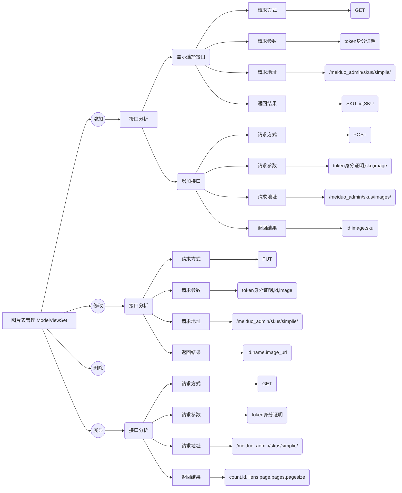

### 查询-接口分析

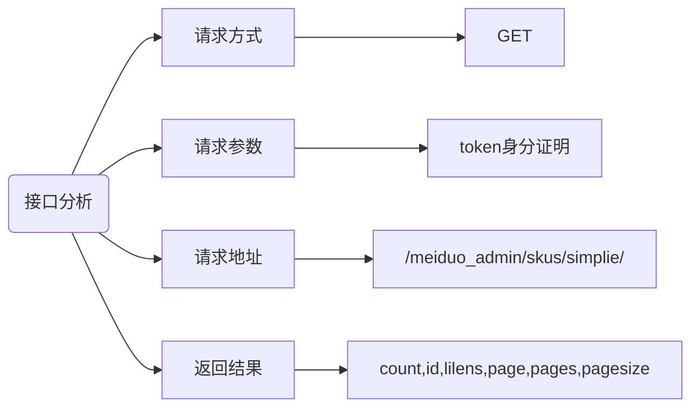

**请求方式**：GET  /meiduo_admin/skus/simplie/

**请求参数**：token

**返回参数**：JSON

```
{
count：图片个数，
lilens：[data]，
page：页码，
pages：总页数，
pagesize：页容量，
}
```

| 返回参数 | 类型 | 是否必需 |  说明  |
| :------: | :--: | :------: | :----: |
|  count   | int  |    是    |  个数  |
|  lilens  | 数组 |    是    |  数据  |
|   page   | int  |    是    |  页码  |
| pagesize | int  |    是    | 页容量 |
|  pages   | int  |    是    |  页数  |


### 增加-接口分析 


#### 显示选择接口

​	**请求方式**：GET

​	**请求参数**：token

| 参数  | 类型 |   携带地址   | 是否必传 |   说明   |
| :---: | :--: | :----------: | :------: | :------: |
| token | str  | body(请求体) |    是    | 身份验证 |

​	**返回数据**： 

```JSon
[
{sku_id:'',sku_name:''},
{sku_id:'',sku_name:''}
....
]
```

| 返回参数 | 类型 | 是否必需 |    说明     |
| :------: | :--: | :------: | :---------: |
|    id    | int  |    是    |  sku商品id  |
|   name   | str  |    是    | sku商品名称 |

#### 增加图片数据接口

​	**请求方式：**POST /meiduo_admin/skus/images/

​	**请求参数：**token， id，name

| 参数  | 类型 |    携带地址     | 是否必传 |   说明    |
| :---: | :--: | :-------------: | :------: | :-------: |
| token | str  | headres(请求行) |    是    | 身份验证  |
|  id   | int  |  body(请求体)   |    是    | sku商品id |
| name  | str  |  body(请求体)   |    是    | sku商品id |

​	**返回数据：**JSON

```JSON
{
id:""
sku_id:"",
image_url:"",
}
```

| 返回参数  | 类型 | 是否必传 |   说明   |
| :-------: | :--: | :------: | :------: |
|    id     | int  |    是    |  图片id  |
|  sku_id   | int  |    是    |  商品id  |
| image_url | str  |    是    | 图片地址 |

## 业务分析

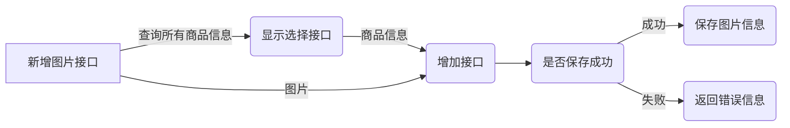

### 更新-接口分析

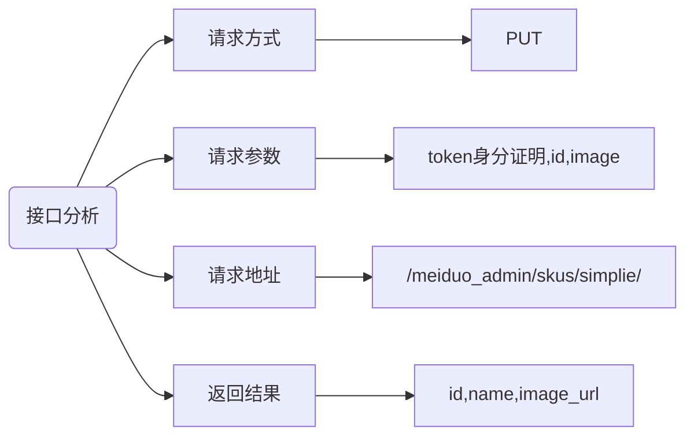

**请求方式**：PUT  /meiduo_admin/skus/simplie/

**请求参数**：token,id,image

| 参数  | 类型  | 是否必传 |      携带部位       |   说明   |
| :---: | :---: | :------: | :-----------------: | :------: |
| token |  str  |    是    |  headers（请求头）  | 身份验证 |
|  id   |  int  |    是    |   body（请求体）    |  商品id  |
| image | bytes |    是    | body（请求体files） | 上传图片 |

​	**返回参数**：

​	{

id：图片id，

image_url:图片地址，

sku_id:商品id，

}

| 返回参数 | 类型 | 是否必需 |   说明   |
| :------: | :--: | :------: | :------: |
|    id    | int  |    是    |  图片id  |
|  image   | str  |    是    | 图片地址 |
|  sku_id  | int  |    是    |  商品id  |

### sku表管理

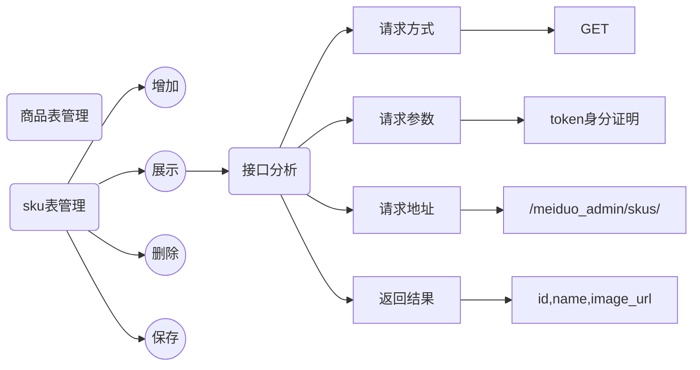

#### sku展示接口

​	多个展示接口

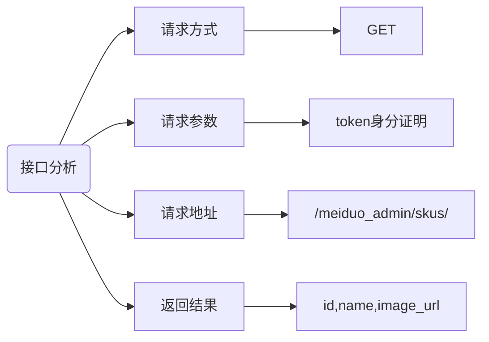

**请求方式**：GET  /meiduo_admin/skus/

**请求参数**：token

| 参数  | 类型 | 是否必传 |   说明   |
| :---: | :--: | :------: | :------: |
| token | str  |    是    | 身份验证 |

**返回参数**：

```json
{
        "counts": "商品SPU总数量",
        "lists": [
            {
                "id": "商品SKU ID",
                "name": "商品SKU名称",
                "spu": "商品SPU名称",
                "spu_id": "商品SPU ID",
                "caption": "商品副标题",
                "category_id": "三级分类id",
                "category": "三级分类名称",
                "price": "价格",
                "cost_price": "进价",
                "market_price": "市场价格",
                "stock": "库存",
                "sales": "销量",
                "is_launched": "上下架",
                "specs": [
                    {
                        "spec_id": "规格id",
                        "option_id": "选项id"
                    },
                    ...
                ]
            },
            ...
          ],
            "page": "页码",
            "pages": "总页数",
            "pagesize": "页容量"
      }
```

|  返回值  | 类型 | 是否必须 |    说明    |
| :------: | :--: | :------: | :--------: |
|  count   | int  |    是    | SKUs商总量 |
|  lists   | 数组 |    是    |  SKU信息   |
|   page   | int  |    是    |    页码    |
|  pages   | int  |    是    |   总页数   |
| pagesize | int  |    是    |   页容量   |

后面由于个人，已经略过了


### 订单接口

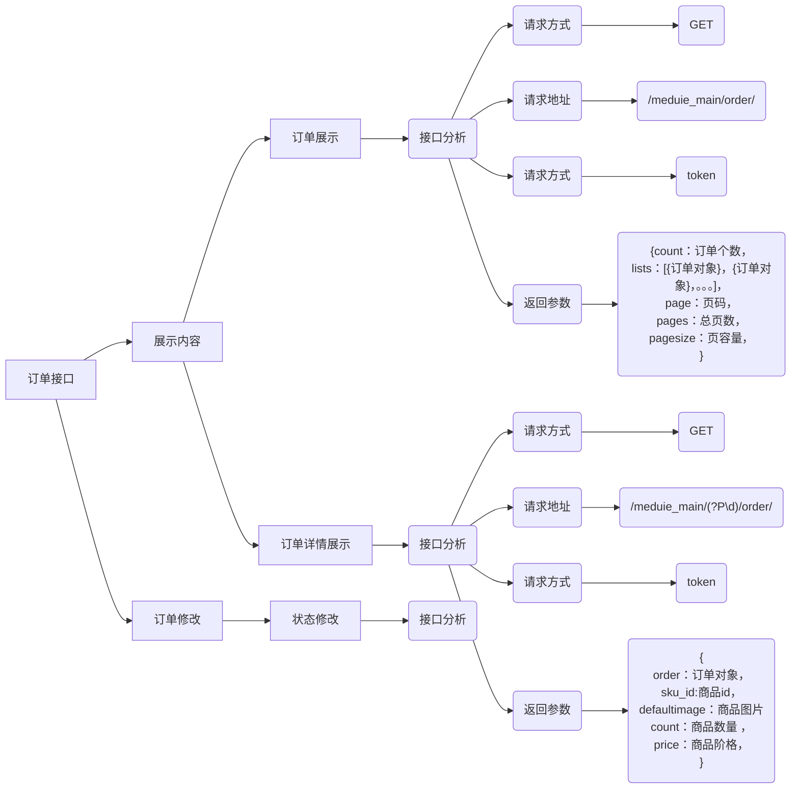

#### 订单展示 

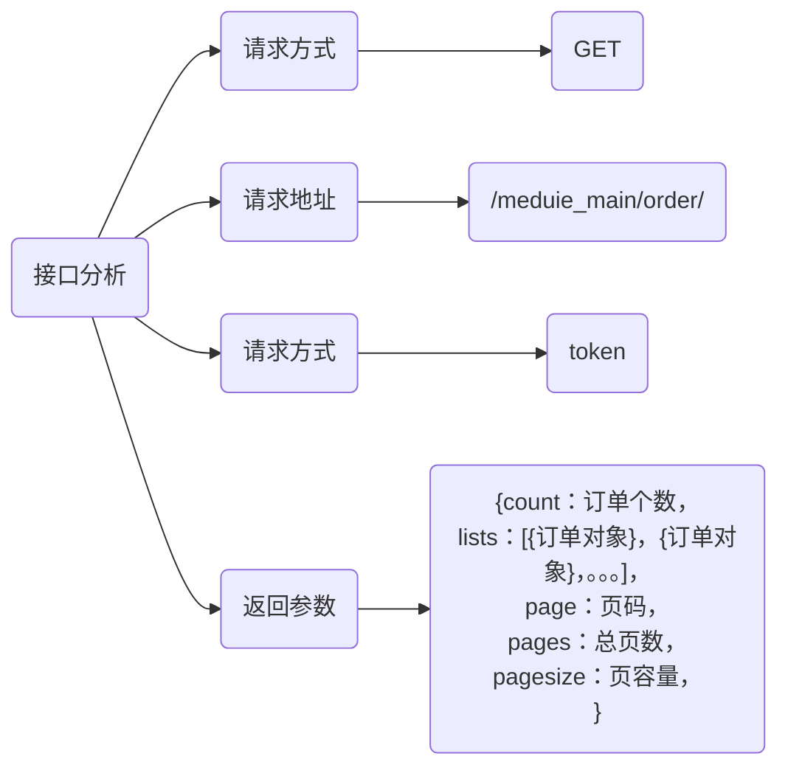

​	**请求方式**:GET /meduie_main/order/

​	**请求参数**：token

| 参数  | 类型 | 是否必传 |     携带部位      |   说明   |
| :---: | :--: | :------: | :---------------: | :------: |
| token | str  |    是    | 请求头（headres） | 身份验证 |

​	**返回结果**：JSON

```json
{

count：订单个数，
lists：[{订单对象}，{订单对象}，。。。]，
page：页码，
pages：总页数，
pagesize：页容量，

}
```

| 返回参数 | 类型 | 是否必需 |   说明   |
| :------: | :--: | :------: | :------: |
|  count   | int  |    是    | 订单个数 |
|  lists   | list |    是    | 数据内容 |
|  pages   | int  |    是    |  总页数  |
|   page   | int  |    是    |   页码   |
| pagesize | int  |    是    |  页容量  |

#### 订单详细接口

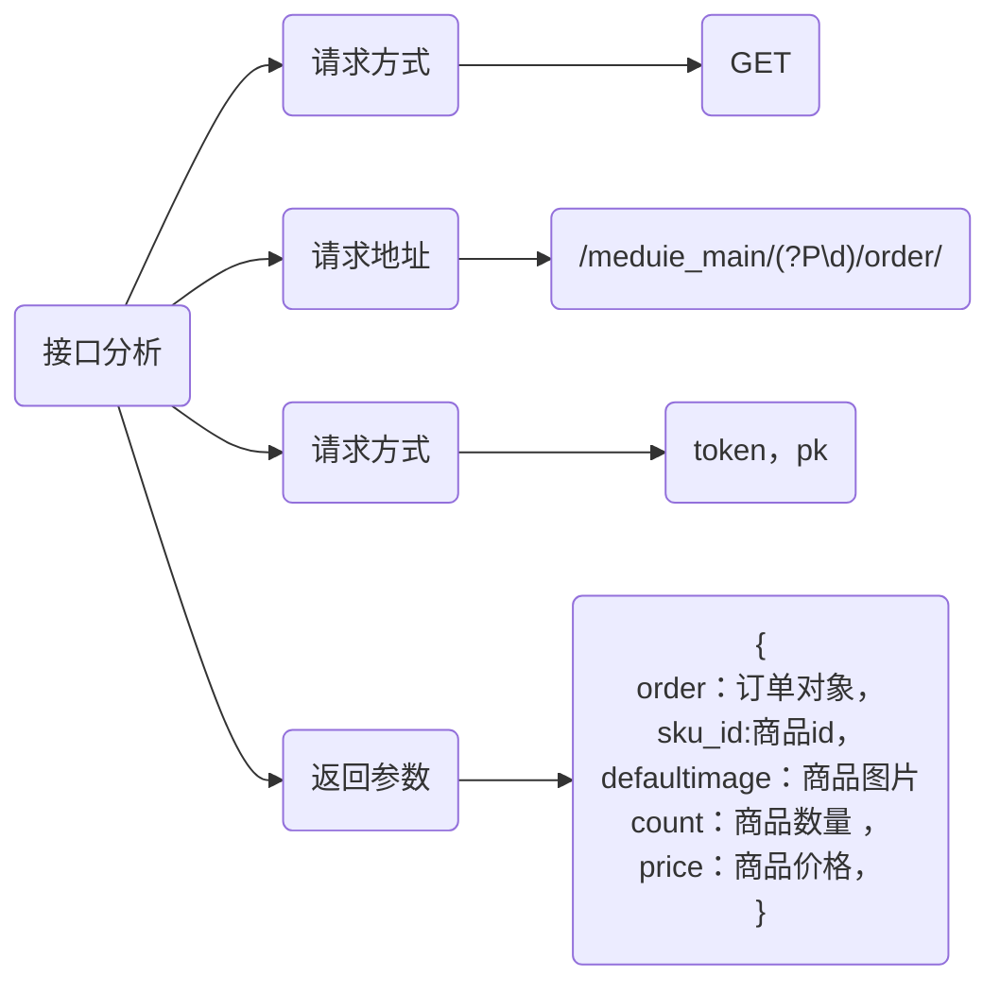

**请求方式**：GET

**请求参数**：pk， token

| 参数  | 类型 | 是否必传 |    携带部位     |   说明   |
| :---: | :--: | :------: | :-------------: | :------: |
|  pk   | int  |    是    | 请求行（lines） |  订单id  |
| token | str  |    是    | 请求头（heads） | 身份验证 |

**返回结果**：JSON

```
{
order：订单对象，
count：商品个数，
sku_id:商品id，
default：商品图片，
price：商品价格，
}
```

| 返回参数 |   类型    | 是否必需 |   说明   |
| :------: | :-------: | :------: | :------: |
|  order   | <objects> |    是    | 订单对象 |
|  count   |    int    |    是    | 商品个数 |
|  sku_id  |    int    |    是    |  商品id  |
|  price   |    int    |    是    | 商品价格 |
| default  |    str    |    是    | 图片地址 |

#### 订单状态修改

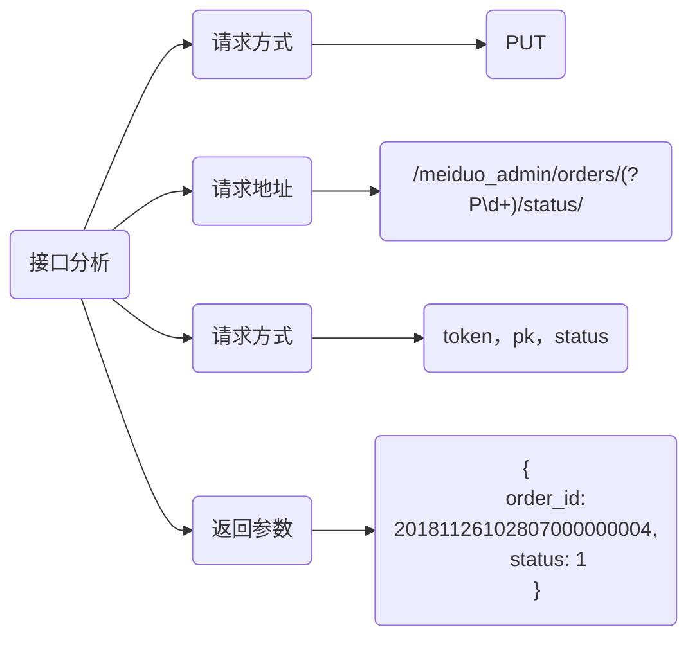

**请求方式**:PUT /meiduo_admin/orders/(?P<order_id>\d+)/status/

**请求参数**：token，pk，status

|  参数  | 类型 | 是否必传 |     携带部位      |   说明   |
| :----: | :--: | :------: | :---------------: | :------: |
| token  | str  |    是    | 请求头（headers） | 身份验证 |
|   pk   | str  |    是    |  请求体（body）   |  订单id  |
| status | int  |    是    |  请求体（body）   | 订单状态 |

**返回参数**：JSON

```json
{order_id:订单id，
status：订单状态}
```

| 返回参数 | 类型 | 是否必需 |   说明   |
| :------: | :--: | :------: | :------: |
| order_id | str  |    是    |  订单id  |
|  status  | int  |    是    | 订单状态 |

